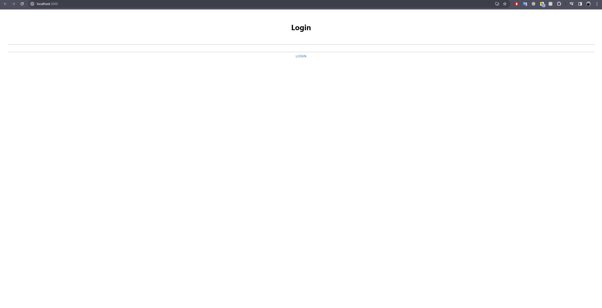

# Cameras

[Frontend (written by another contributor)](https://github.com/Surveillance-project/front-end)

REST Web service for finding cameras by districts, viewing image records, reporting crimes. Cameras integration is done through communication with third-party webcameras api.

Unfortunately, the chosen windy api plan does not allow to host applications that use this api.

This is the reason why there are:

### Images

